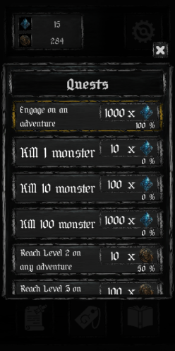
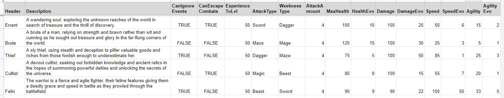
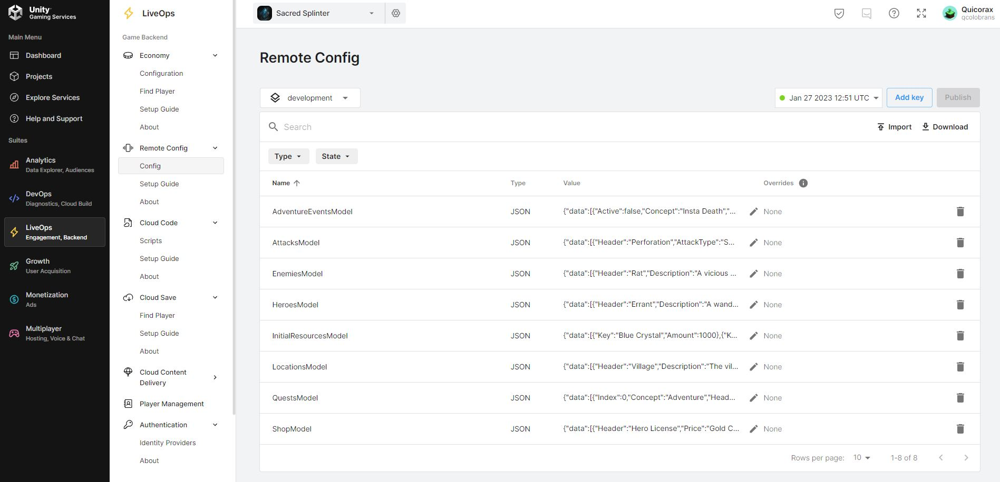

# PEC 4 - Sacred Splinter - Quim Colobrans Ramírez

Sacred Splinter está disponible en plataforma móvil en Google Play.
 
## ---Como jugar---
Sacred Spliter en un profundo juego de Rol de combate por turnos para dispositivos móviles, donde el jugador deberá explorar distintas mazmorras usando diversos héroes para hacerse con antiguas reliquias a medida que la dificultad aumenta.

Al iniciar la aplicación, y después de la pantalla de carga de servicios, el usuario llegará a la escena "Menú" donde podrá acceder al panel de configuración, ver los recursos que tiene disponibles, acceder a la lista de misiones, la tienda y la enciclopedia. 
Si el jugador pulsa el botón de jugar, accederá al panel de Configuración de Aventura, donde deberá escoger la localización que quiere explorar, y el héroe con el que quiere jugar. Una vez configurado, se puede empezar la aventura.

### Aventuras
Una vez dentro de una aventura, el usuario sigue pudiendo acceder a la configuración de la aplicación, desde donde podrá abandonar la aventura en cualquier momento, y a sus recursos.
Las aventuras están estructuradas en habitaciones y pisos. Cada aventura tiene "x" pisos y cada piso tiene "y" habitaciones.
Al final de cada piso, después de completar "y" habitaciones, hay un combate contra un "Jefe de piso". Al completar todos los pisos de la aventura hay un "Jefe de aventura".
La disposición de habitaciones en cada piso es aleatoria entre su tipo, y la cantidad de habitaciones a las que puedes acceder desde tu actual habitación (entre 1 o 2).
Las habitaciones base que componen cada piso pueden ser de tipo Evento o Combate.

Las habitaciones de Evento plantean una situación, y una forma de actuar del personaje. El resultado de los eventos es definido aleatoriamente y puede implicar, perdida o ganancia de recursos o puntos de vida.

Las habitaciones de Combate enfrentan al héroe con un enemigo. El combate es por turnos. En su turno, el jugador deberá escoger entre las habilidades disponibles para atacar al enemigo. Si en el turno del enemigo este no está muerto, atacará con alguna de sus habilidades, dañando al héroe.
Si se completa satisfactoriamente un combate, el héroe gana experiencia y recursos. Si el héroe consigue suficiente experiencia, sube de nivel, lo que aumenta sus características ofensivas y defensivas.

La muere del héroe, tanto por el resultado de un evento o de un combate, implica la perdida de progreso en la aventura, pero no de los recursos conseguidos en esta.

El objetivo final del juego es derrotar todos los "Jefes de Aventura", para así recuperar las diversas "Sacred Splinters".

### Héroes
Los distintos héroes se definen por sus distintas características. Dichas características son: Vida, Daño, Velocidad, Agilidad, Tipo de ataque, Debilidad de ataque, capacidad de ignorar eventos y capacidad de escapar combates normales.

Al iniciar un juego nuevo, el usuario tiene acceso al héroe "Errante". A medida que avance en la aventura, consiga recursos y complete misiones, podrá expandir su colección y explorar nuevas formas de jugar.
El progreso del héroe (nivel, características, etc) es intrínseco de la aventura, al morir o completar una localización, el héroe vuelve a su estado original.

### Elementos adicionales
- Misiones: El usuario tiene un seguido de misiones que podrá completar a medida que avance en las distintas aventuras. Completar dichas aventuras recompensa al usuario con recursos.
- Tienda: El usuario puede usar la tienda para intercambiar y comprar recursos, como por ejemplo las "Licencias de Héroe", que nos permitirán desbloquear nuevos héroes.
- Enciclopedia: La enciclopedia contiene información de todos los enemigos a los que el usuario se ha enfrentado en sus aventuras.

## ---Estructura de la aplicación---
Sacred Splinter está estructurado en 3 escenas: Carga de servicios, Menú y Juego.
- La primera escena se encarga de cargar todos los servicios que Sacred Splinter requiere.
- La segunda escena actúa de base para el usuario, y es donde configurará las aventuras, intercambiará recursos, completará misiones, etc.
- La tercera escena es donde sucede el "core gameplay". Una vez configurada la aventura desde la escena del menú, la escena del juego se inicializa con las características definidas anteriormente. 
Al completar, morir o escapar de una aventura, el usuario vuelve a la escena de menú.

## ---Características Técnicas---
- Data Driven: La gran mayoría de sistemas que conforman Sacred Splinter han sido desarrollados para que el sistema sea independiente a su contendido. Esto nos permite modificar el input que recibe sistema sin tener que hacer cambios en el entorno lógico.
### Lógica de generación de misiones Data-Driven
 
### Panel de misiones in-game
 

- Remote Config: Los sistemas que siguen la arquitectura "data-driven" nos permiten desacoplar la información de dicho sistema del proyecto. Sacred Splinter está conectado a los Unity Gaming Services (UGS), de forma que los modelos de información de las características "data-driven", son alojados de forma remota en la funcionalidad "Remote Config" de los UGS. 
Esto no solo nos permite modificar los parámetros de los modelos de forma totalmente ajena al proyecto, sino que nos permite alterar dichos modelos en builds del proyecto que ya hayan sido publicadas (siempre que la estructura de datos sea la misma).
Tener los modelos en remoto supone un gran veneficio en cuanto al proyecto por la fácil adición de nuevo contenido sin necesidad de actualizar la build.
### Modelo remoto: Heroes 

Excel -> JSON -> Unity Gaming Services
### Modelos remotos en el Unity Gaming Services

Adjunto en formato JSON los modelos remotos en el repositorio Git. [Local Remote Models](RemoteModels)
- Cloud Save: Otra funcionalidad implementada de los Unity Gaming Services en Sacred Splinter es el "Cloud Save". Funcionalidad que nos permite salvar el progreso de los usuarios en la nube.

## ---Enlazes---
- Vídeo:            ---
- Google Play:      https://play.google.com/store/apps/details?id=com.Quicorax.SacredSplinter
- Repositorio Git:  https://gitlab.com/qcolobrans/pec-4-quimcolobrans

## ---Créditos---
- Desarrollado por: Quim Colobran Ramirez - @quicorax

- Icon Sprites por: Game-icons.net
- Font por:         Juan Casco (Por Siempre Gotica)

- Sobre el arte:

Sacred Splinter usa elementos artísticos generados con la herramienta Midjourney. Que posteriormente han sido alterados para que encajen dentro del contexto del proyecto.
El uso de esta herramienta para el desarrollo artístico de este proyecto prototipo se justifica en cuanto que el peso y la importancia de Sacred Splinter reside en su característica técnica, que el proyecto ha sido desarrollado en aproximadamente 30 días, por un único desarrollador y sin fines económicos.

